<div align="center">


[](https://www.linkedin.com/in/gabriel-marques-6bb222174/)
[](mailto:pessoalgabriel2003@gmail.com)
[](#)
[](https://github.com/GabrielMarques011)

</div>

## 🤖 Sobre

```python
class AutomationEngineer:
    def __init__(self):
        self.name = "Gabriel Marques"
        self.age = 22
        self.role = "Analista de TI Junior"
        self.focus = ["Process Automation", "Web Development", "System Integration"]
        self.mission = "Transformar processos manuais em soluções automatizadas eficientes"
    
    def current_work(self):
        return {
            "company": "TI Department",
            "responsibilities": [
                "Automatização de processos internos",
                "Desenvolvimento de scripts Python",
                "Integração de sistemas",
                "Suporte técnico especializado em redes"
            ]
        }
    
    def expertise(self):
        return [
            "Backend Development (Python, Node.js)",
            "Frontend Development (React, TypeScript)",
            "Web Scraping & Automation",
            "API Integration",
            "Database Automation",
            "Fullstack Project Implementation"
        ]

gabriel = AutomationEngineer()
```

<div align="center">

**Experiência prática em ferramentas de automação, focado em otimizar tarefas e processos repetitivos.**

</div>

---

## ⚡ Stack Tecnológico

<div align="center">

### 🔧 Automação & Backend


### 🌐 Frontend & Web


### 🗄️ Database & Cloud


### 🛠️ Ferramentas & DevOps


</div>

---

## 🚀 Projetos em Destaque

### 🔄 Sistema de Automação de Relatórios
**Tecnologias:** `Python` `Pandas` `Selenium` `MySQL`
- Automatização completa de geração de relatórios mensais
- Redução de 8 horas de trabalho manual para 15 minutos
- Integração com múltiplas fontes de dados
- **Impacto:** 95% de redução no tempo de processamento

### 🌐 Dashboard de Monitoramento de Processos
**Tecnologias:** `React` `Node.js` `MongoDB` `Chart.js`
- Interface web para visualização de processos automatizados
- Sistema de alertas em tempo real
- Métricas de performance e relatórios customizáveis
- **Resultado:** Melhoria de 40% na eficiência operacional

### 🤖 Bot de Integração Slack/Teams
**Tecnologias:** `Python` `API REST` `Webhooks` `Azure`
- Automatização de notificações entre plataformas
- Sincronização de status de projetos
- Comandos personalizados para consultas rápidas
- **Benefício:** Comunicação 60% mais eficiente

---

## 📊 GitHub Analytics

<div align="center">
   
  
</div>

<div align="center">
  
</div>

---

## 🎯 Roadmap 2025

```mermaid
graph LR
    A[Q1 2025] --> B[Aperfeiçoamento Backend - Node.js e APIs]
    B --> C[Q2 2025]
    C --> D[Aperfeiçoamento Frontend - React e TypeScript]
    D --> E[Q3 2025]
    E --> F[Integração Backend e Frontend em Projetos de Automação]
    F --> G[Q4 2025]
    G --> H[Projetos Fullstack Avançados e Otimização de Fluxos]
```



### 📈 Objetivos Técnicos
- [x] **Selenium & Web Scraping** - Automatização de tarefas web
- [x] **Python & Node.js** - Automação de processos e desenvolvimento backend
- [ ] **React & TypeScript** - Desenvolvimento frontend moderno
- [ ] **APIs e Integração de Sistemas** - Conectar serviços e fluxos de trabalho
- [ ] **Docker & Kubernetes** - Containerização e deployment de aplicações
- [ ] **Projetos Fullstack** - Combinar backend e frontend para automação de projetos

---

## 📫 Vamos Colaborar?

<div align="center">

```ascii
╭─────────────────────────────────────────────╮
│  💼 Aberto para oportunidades em:           │
│  • Automação de Processos                   │
│  • Desenvolvimento Full Stack               │
│  • Integração de Sistemas                   │
╰─────────────────────────────────────────────╯
```

[](https://www.linkedin.com/in/gabriel-marques-6bb222174/)
[](mailto:pessoalgabriel2003@gmail.com)

**"Automatizar o presente, construir o futuro"** 🚀

</div>

---

<div align="center">


</div>


